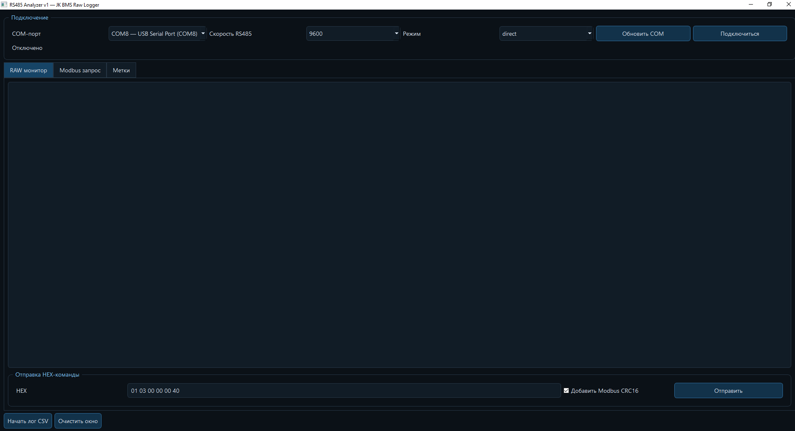

# JK BMS RS-485 Analyzer & Diagnostic Tool

Engineering software for direct communication, protocol analysis, diagnostics and testing of a **single JK BMS** over RS-485.

This project was developed as part of the **Axentum autonomous mobile robot project** during the development and commissioning of its high-power LiFePO4 traction battery system.

Unlike the later multi-BMS Battery Monitor System, this application works with **one BMS at a time** and was created primarily for protocol research, low-level diagnostics, communication testing and engineering verification.

## Project Purpose

The JK BMS RS-485 Analyzer was developed to provide direct access to the communication channel between a PC and a JK Smart Active Balance BMS.

It allows an engineer to inspect raw RS-485 traffic, send custom commands, verify Modbus communication, log packets, test communication settings and diagnose the behavior of the BMS during development.

This software was used as an engineering tool before and during development of the later Axentum multi-BMS monitoring system.

## Main Features

- Direct communication with one JK BMS over RS-485
- COM-port selection and configurable baud rate
- Raw HEX packet monitoring with timestamps
- Manual transmission of custom HEX commands
- Modbus command and register testing
- Automatic Modbus CRC16 calculation
- Communication diagnostics and BMS response verification
- Packet and CSV logging
- Manual engineering notes / event markers
- Protocol analysis and commissioning support

## Communication Options

### USB-RS485

Direct PC connection through a USB-to-RS485 adapter:

`PC -> USB -> USB-RS485 Adapter -> RS-485 -> JK BMS`

### Arduino Mega + MAX485 Bridge

The software can also be used with an Arduino Mega and MAX485 communication bridge for hardware-level protocol testing and integration work:

`PC -> USB Serial -> Arduino Mega -> MAX485 -> RS-485 -> JK BMS`

## Axentum Project Context

The analyzer was developed for the **Axentum project**, a large autonomous wheeled robot designed for automated handling and deployment of solar panels.

Axentum uses a custom high-power LiFePO4 traction battery architecture. During development, this tool was used to select and configure JK BMS hardware, test RS-485 communication, verify BMS responses, analyze raw protocol data, validate commands, debug communication reliability, confirm register values and prepare the communication architecture for integration into the complete robot.

## Relationship to the Multi-BMS Monitor

This repository represents the **single-BMS engineering and protocol-analysis tool**.

A later application was developed for the actual Axentum traction-battery architecture, where **three JK BMS units are monitored simultaneously** as one combined battery system.

Single-BMS tool:

`JK BMS -> RS-485 -> JK BMS RS-485 Analyzer`

Later Axentum multi-BMS system:

`JK BMS #1 / #2 / #3 -> RS-485 -> Axentum 3-BMS Battery Monitor`

The two applications therefore serve different purposes:

- **JK BMS RS-485 Analyzer** — low-level testing, protocol analysis, diagnostics and single-BMS communication.
- **Axentum 3-BMS Battery Monitor System** — real-time monitoring and diagnostics of three BMS-controlled battery modules operating together.

## Typical Engineering Workflow

1. Connect one JK BMS through USB-RS485 or the Arduino bridge.
2. Select the COM port and baud rate.
3. Establish communication and observe incoming raw packets.
4. Send test commands or Modbus requests.
5. Verify CRC, packet structure and returned register values.
6. Record communication logs and diagnose configuration or communication issues.
7. Use the verified protocol behavior in the higher-level monitoring system.

## Software and Hardware

The project includes Python desktop software for serial communication, raw-packet monitoring, Modbus request generation, CRC processing, data logging and engineering diagnostics. It also supports an **Arduino Mega + MAX485 RS-485 bridge** used during hardware-level testing.

Primary target family: **JK Smart Active Balance BMS**.

Typical interfaces and hardware used during development include RS-485, USB-RS485 adapters, Arduino Mega and MAX485 transceivers.

## Project Status

This repository documents the first engineering version used for single-BMS diagnostics and protocol analysis. It was later followed by a dedicated **three-BMS monitoring application** for the complete Axentum traction-battery system.

---

# Русское описание

## JK BMS RS-485 Analyzer — анализатор и диагностический инструмент

Это инженерное приложение для прямой связи, анализа протокола, диагностики и тестирования **одной JK BMS** по интерфейсу RS-485.

Программа была разработана в рамках проекта **Axentum** — большого автономного колёсного робота для автоматизированной транспортировки и раскладки солнечных панелей. Она использовалась при разработке и отладке мощной тяговой LiFePO4 аккумуляторной системы робота.

В отличие от более новой версии Battery Monitor System, рассчитанной на одновременную работу с тремя BMS, данная программа подключается **к одной BMS за один сеанс** и предназначена прежде всего для низкоуровневой диагностики и исследования протокола.

## Назначение программы

Программа позволяет инженеру напрямую работать с каналом связи между компьютером и JK Smart Active Balance BMS: анализировать сырые пакеты RS-485, отправлять собственные команды, проверять Modbus-запросы, рассчитывать CRC16, читать ответы BMS, записывать логи и диагностировать проблемы связи и конфигурации.

## Основные возможности

- подключение к одной JK BMS по RS-485;
- выбор COM-порта и скорости обмена;
- отображение RAW HEX пакетов с временными метками;
- ручная отправка HEX-команд;
- тестирование Modbus-команд и регистров;
- автоматический расчёт Modbus CRC16;
- проверка ответов BMS;
- диагностика RS-485 связи;
- запись пакетов и CSV-логов;
- добавление инженерных заметок и событий;
- анализ протокола во время разработки и пусконаладки.

## Варианты подключения

Программа может работать напрямую через адаптер USB-RS485:

`PC -> USB -> USB-RS485 -> RS-485 -> JK BMS`

Также поддерживается инженерный вариант подключения через Arduino Mega и MAX485:

`PC -> USB Serial -> Arduino Mega -> MAX485 -> RS-485 -> JK BMS`

Этот вариант использовался для аппаратной отладки, исследования протокола и интеграционных испытаний.

## Использование в проекте Axentum

В проекте Axentum программа применялась для настройки JK BMS, проверки RS-485 связи, анализа ответов BMS, исследования сырых данных протокола, тестирования команд и регистров и подготовки дальнейшей интеграции аккумуляторной системы с электроникой мобильного робота.

Позже для финальной архитектуры Axentum была разработана отдельная система мониторинга, способная одновременно получать и анализировать данные **трёх JK BMS**, работающих в составе общей тяговой аккумуляторной системы.

Таким образом:

- **JK BMS RS-485 Analyzer** — инженерная диагностика и анализ одной BMS;
- **Axentum 3-BMS Battery Monitor System** — мониторинг трёх BMS одновременно в составе общей аккумуляторной системы робота.

## Разработчик

**Oleg Gridin**  
CEO / Lead Engineer — GEC Engineering

Website: https://gec-engineering.tech/  
YouTube: https://www.youtube.com/@GEC_Company  
GitHub: https://github.com/gridinwork
